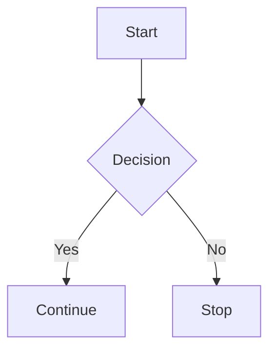

# MD Reader — VS Code Extension

A reading-focused, fully customizable Markdown viewer for Visual Studio Code. Unlike other Markdown preview extensions, MD Reader correctly handles **multiple independent document windows** — each Markdown file gets its own fully isolated reader panel with independent state.

## Getting started

1. Right-click a `.md` file (in the Explorer, an editor tab, or inside the editor) → **Open in MD Reader**.
2. Once a reader panel is focused, its title bar shows a small toolbar: **Find**, **Table of Contents**, **Settings**, **Refresh**, and a **?** (keyboard shortcuts) icon.
3. Press **`?`** anywhere in the panel, or click the **?** icon, to see every keyboard shortcut without leaving the reader.
4. `Ctrl+Shift+P` → type **MD Reader** to see every command this extension adds, including the two not in the toolbar (**Export as PDF...**, **Export as HTML...**).

That command-palette list and the in-panel `?` overlay are the two fastest ways to discover everything below — this README is the fuller reference.

## Features

- 📖 **Multi-document support** — Open as many Markdown files as you want; each gets its own independent reader panel. No shared state, no conflicts.
- 🎨 **4 themes** — Light, Dark, Sepia, and Auto (follows VS Code's color theme automatically), plus an adjustable amber **Eye Care** blue-light filter.
- 🖊️ **Fully customizable typography** — Pick from curated font families (serif, sans-serif, monospace), any font size from 10px to 72px, and line height.
- 📐 **6 reading widths** — Narrow, Medium, Wide, Wider, Ultra, and Full (100% window width).
- 📋 **Table of Contents** — Auto-generated floating overlay with active heading highlight as you scroll.
- 📊 **Reading progress bar + estimated reading time** — A thin progress bar tracks scroll position; a small corner badge shows "N min read · N,NNN words" (configurable words-per-minute).
- 🔍 **Find in document** — `Ctrl`/`Cmd`+`F` opens an in-panel find bar (VS Code's own Find doesn't reach webview content) with match count, case toggle, and Enter/Shift+Enter navigation.
- ⌨️ **Full reading-mode keyboard map** — see [Keyboard Shortcuts](#keyboard-shortcuts) below, or press `?` in the panel.
- 💻 **Syntax highlighting** — Code blocks with language labels and one-click copy-to-clipboard.
- 📈 **Mermaid diagrams** — ` ```mermaid ` fenced code blocks render as diagrams (lazy-loaded, so documents without one pay no cost).
- 🧮 **Math (KaTeX)** — `$inline$` and `$$block$$` math, rendered server-side.
- 📝 **GFM footnotes** — `[^1]` reference / `[^1]: definition` syntax, with back-reference links.
- 🗂️ **YAML front matter** — a leading `---` block renders as a metadata card (title/author/date/tags/...), or can be hidden or shown as a raw code block (`mdReader.frontMatter`).
- ☑️ **Interactive task lists** — click a `- [ ]` checkbox in the reader to toggle it in the source file.
- 🔗 **Smart link navigation** — a relative `.md`/`.markdown` link opens in another reader panel; external links open in your browser; `#anchor` links scroll locally.
- 🔖 **Heading anchor links** — hover a heading for a "copy link" button (`file.md#heading-id`).
- 🖼️ **Image lightbox** — click any image for a full-screen, scroll-to-zoom preview.
- 📌 **Scroll position persistence** — a save-triggered refresh doesn't jerk the reader back to the top.
- 🔄 **Auto-refresh** — panels update automatically on save, *and* when the file changes outside VS Code's editor (another program, `git checkout`, a second VS Code window) while the tab is open in the background.
- 🔗 **Scroll sync** — two-way synchronization between the editor and reader panel.
- 🖨️ **Export as PDF** — via a dedicated print stylesheet and VS Code's native print dialog.
- 📤 **Export as HTML** — a standalone, self-contained `.html` file (styles + local images inlined).
- 🎨 **Custom CSS** — point `mdReader.customCssPath` at your own stylesheet for personal overrides.
- ⚡ **Live config** — change any drawer setting and all open panels update instantly without reloading.

## Usage

| Action | How |
|---|---|
| Open reader (split view) | Right-click a `.md` file → **Open in MD Reader** |
| Open in new column | `Ctrl+Shift+P` → **MD Reader: Open in MD Reader (New Column)** |
| Refresh current / all panels | `Ctrl+Shift+P` → **MD Reader: Refresh Reader** / **Refresh All Reader Panels** |
| Export as PDF | `Ctrl+Shift+P` → **MD Reader: Export as PDF...** (opens VS Code's print dialog — choose "Save as PDF") |
| Export as HTML | `Ctrl+Shift+P` → **MD Reader: Export as HTML...** (prompts for a save location) |
| Show keyboard shortcuts | Press `?` in the panel, or `Ctrl+Shift+P` → **MD Reader: Show Keyboard Shortcuts** |

## Toolbar

When a reader panel is focused, a toolbar appears in the panel's title bar:

| Icon | Button | Action |
|---|---|---|
| `$(search)` | Find | Open the in-panel find bar (`Ctrl`/`Cmd`+`F`) |
| `$(list-tree)` | Table of Contents | Toggle the floating TOC overlay |
| `$(gear)` | Settings | Open the settings drawer |
| `$(refresh)` | Refresh | Re-render the current panel |
| `$(question)` | Shortcuts | Open the keyboard-shortcuts help overlay |

The settings drawer covers the most-adjusted options live (theme, font, size, line height, reading width, eye care, scroll sync); everything else — including export, custom CSS, and front matter handling — is a VS Code setting (`Ctrl+,` → search `mdReader`) or a command-palette command, per the tables below.

## Keyboard Shortcuts

Press `?` inside any reader panel to see this list without leaving it.

| Key | Action |
|---|---|
| `Ctrl`/`Cmd` + `F` | Find in document |
| `Enter` / `Shift`+`Enter` | Next / previous match (while the find bar is open) |
| `j` / `k` | Scroll down / up |
| `Space` / `Shift`+`Space` | Page down / up |
| `g` / `G` | Jump to top / bottom of the document |
| `n` / `p` | Next / previous heading |
| `t` | Toggle table of contents |
| `s` | Toggle settings drawer |
| `Ctrl`/`Cmd` + `+` / `-` / `0` | Increase / decrease / reset font size |
| `Esc` | Close whichever panel is open (find > shortcuts help > settings > TOC > image lightbox) |
| `?` | Toggle this shortcuts help |

Single-key shortcuts (`j`, `k`, `t`, `s`, etc.) are disabled while focus is in the find box or a settings control, so typing there is unaffected.

## Font Families

The font family picker is grouped by type:

| Group | Fonts |
|---|---|
| **Serif** | Georgia, Palatino, Times New Roman, Garamond, Book Antiqua |
| **Sans-Serif** | Segoe UI, Inter, Arial, Verdana, Calibri |
| **Monospace** | JetBrains Mono, Cascadia Code, Courier New |

## Reading Widths

| Option | Width | Best for |
|---|---|---|
| Narrow | 640px | Focused distraction-free reading |
| Medium *(default)* | 760px | Balanced layout |
| Wide | 960px | Tables and wide code blocks |
| Wider | 1100px | Large monitors |
| Ultra | 1400px | Maximum fixed column |
| Full | 100% | Edge-to-edge, no side margins |

## Mermaid Diagrams

Use a fenced code block with the `mermaid` language tag:

````markdown

````

The diagram-rendering script only loads for documents that actually contain one, and matches your current theme (light/dark). If a diagram fails to parse, its raw source stays visible instead of a blank panel.

## Math

```markdown
Inline math: $E = mc^2$

Block math:

$$
\int_0^1 x\,dx = \frac{1}{2}
$$
```

Malformed formulas render as a visible error span rather than breaking the rest of the document.

## Front Matter

A leading YAML block:

```markdown
---
title: My Post
author: Jane Doe
tags:
  - markdown
  - vscode
---
```

is rendered as a metadata card by default. Change this with `mdReader.frontMatter`:

| Value | Behavior |
|---|---|
| `card` *(default)* | Metadata card above the content |
| `hide` | Stripped silently |
| `raw` | Shown as an ordinary, syntax-highlighted `yaml` code block |

Only simple scalars and lists are understood (no nested objects or multi-line strings); anything else falls back to being treated as ordinary document content.

## Configuration

All settings are under `mdReader.*` in VS Code Settings (`Ctrl+,`):

| Setting | Default | Description |
|---|---|---|
| `mdReader.theme` | `auto` | Color theme: `auto` / `light` / `dark` / `sepia` |
| `mdReader.fontFamily` | `Georgia, 'Times New Roman', serif` | Body font family |
| `mdReader.fontSize` | `17` | Base font size in px (10–72) |
| `mdReader.lineHeight` | `1.85` | Line spacing multiplier |
| `mdReader.readingWidth` | `medium` | Reading column width |
| `mdReader.showTOC` | `true` | Enable table of contents |
| `mdReader.codeTheme` | `github-dark` | Syntax highlight theme for code blocks |
| `mdReader.blueLightFilter` | `0` | Eye Care overlay opacity, 0–100 (0 = off) |
| `mdReader.autoRefresh` | `true` | Refresh panel on save, and when the file changes outside VS Code |
| `mdReader.scrollSync` | `false` | Two-way scroll sync with the editor |
| `mdReader.openBeside` | `true` | Open reader beside the editor (split view) |
| `mdReader.showReadingTime` | `true` | Show the reading-time / word-count badge |
| `mdReader.readingSpeed` | `230` | Words per minute used to estimate reading time |
| `mdReader.frontMatter` | `card` | How to handle a leading `---` YAML block: `card` / `hide` / `raw` |
| `mdReader.customCssPath` | *(empty)* | Absolute path to a CSS file loaded after the reader's own stylesheet, for personal overrides. Takes effect on the next panel open. |
| `mdReader.export.embedImages` | `true` | When exporting as HTML, base64-embed local images so the file is self-contained |

## Commands

Every command below is reachable via `Ctrl+Shift+P` under the **MD Reader** category:

| Command | Also available as |
|---|---|
| Open in MD Reader | Right-click a `.md` file |
| Open in MD Reader (New Column) | — |
| Toggle Table of Contents | Toolbar `$(list-tree)`, `t` |
| MD Reader Settings | Toolbar `$(gear)`, `s` |
| Refresh Reader | Toolbar `$(refresh)` |
| Refresh All Reader Panels | — |
| Find in MD Reader | Toolbar `$(search)`, `Ctrl`/`Cmd`+`F` |
| Export as PDF... | — |
| Export as HTML... | — |
| Show Keyboard Shortcuts | Toolbar `$(question)`, `?` |

## Context Menus

Right-clicking a `.md` file in the **Explorer** or **editor tab** also shows **Open in MD Reader**.

## Windows App

The project also includes a standalone companion desktop application for Windows located in the [windows-app](windows-app) directory. Built with Electron and Vite, it brings the Markdown previewing experience to your desktop with native OS integration. It's a separate app with its own feature set — not a wrapper around this extension — see [windows-app/](windows-app) for its own docs.

### Development Setup

To build and run the Windows app locally, ensure you have **Node.js** installed:

1. **Install Dependencies**:
   ```bash
   cd windows-app
   npm install
   ```

2. **Run in Dev Mode**:
   Starts the Electron app connected to the Vite development server.
   ```bash
   npm run dev
   ```

3. **Build the App**:
   Compile the app and package it into a Windows executable installer using `electron-builder`.
   ```bash
   npm run build
   ```

## License

MIT — See [LICENSE](LICENSE) for details.

## Contributing

Contributions are welcome! This project is open source under the MIT License.
